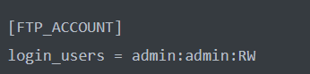
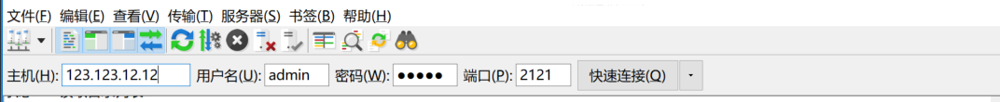

# FTP Server工具

## 使用环境

### 系统环境

操作系统：Linux，推荐使用腾讯云 CentOS 7 系列 CVM，暂不支持 Windows 系统。

推荐下载使用Xshell，FileZilla。以下范例都是在XShell，FileZilla下运行。

Python 解释器版本：Python 2.7，可参考 [Python 安装与配置](https://cloud.tencent.com/document/product/436/10866) 进行安装与配置。

依赖库：

- requests
- argparse

### 下载与安装

GitHub 链接：[COS FTP Server 工具](https://github.com/tencentyun/cos-ftp-server-V5)。

下载完成后，直接运行`cos ftp server`目录下的`setup.py`即可，需要联网安装依赖库。

```
python setup.py install   # 这里可能需要sudo或者root权限
```

## 功能说明

#### 上传机制

流式上传，不落本地磁盘，只要按照标准的 FTP 协议配置工作目录即可，不占用实际的磁盘存储空间。

#### 下载机制

直接流式返回给客户端。

#### 目录机制

Bucket 作为整个 FTP Server 的根目录，Bucket 下面可以建立若干个子目录。

#### 说明

- 目前只支持操作一个 Bucket。
- FTP Server 工具暂不支持断点续传功能。
- 不支持上传空文件（0B），支持的最大文件为 200 GB。

## 支持的 FTP 命令

- put
- mput
- get
- rename
- delete
- mkdir
- ls
- cd
- bye
- quite
- size

## 不支持的 FTP 命令

- append
- mget （不支持原生的 mget 命令，但在某些 Windows 客户端下，仍然可以批量下载，如 FileZilla。）

## 配置文件

### 创建User、文件夹

创建user cos_ftp，进入/home/cos_ftp目录，创建data文件夹

```
useradd cos_ftp
```

```
cd /home/cos_ftp/
```

```
mkdir data
```


`conf/vsftpd.conf`为 FTP Server 工具的配置文件，相关配置项的说明如下：

```
[COS_ACCOUNT]
cos_secretid = XXXXXX
cos_secretkey = XXXXXX
#SecretId 和 SecretKey 可以通过点击控制台右上方账号 -> 访问管理 -> 云API密钥 -> API密钥管理 获取
cos_bucket = BucketName-appid
# 要操作的bucket，bucket的格式为：bucektname-appid组成。示例：cos_bucket = mybucket-125888888888。
endpoint = cos.wh.yun.ccb.com
# Bucket 所在的endpoint
cos_user_home_dir = /data
# FTP Server 的工作目录。
[FTP_ACCOUNT]
login_users = user1:pass1:RW;user2:pass2:RW
# FTP 账户配置。配置格式为<用户名:密码:读写权限>，多个账户用分号分割。

[NETWORK]
masquerade_address = XXX.XXX.XXX.XXX
# 当 FTP Server 处于某个网关或 NAT 后时，可以通过该配置项将网关的 IP 地址或域名指定给 FTP Server。一般情况下，无需配置。
listen_port = 2121
# Ftp Server 的监听端口，默认为 2121，请注意防火墙需要放行该端口。
passive_port = 60000,65535             
# passive_port 可以设置 passive 模式下，端口的选择范围，默认在(60000, 65535)区间上选择。

[FILE_OPTION]
single_file_max_size = 21474836480
# 默认单文件大小最大支持到 200 GB，不建议设置太大。

[OPTIONAL]
# 以下设置，如无特殊需要，建议保留default设置。如需设置，请填写一个合理的整数。
min_part_size       = default
upload_thread_num   = default
max_connection_num  = 512
max_list_file       = 10000                # ls命令最大可列出的文件数目，建议不要设置太大，否则ls命令延时会很高
log_level           = INFO                 # 设置日志输出的级别
log_dir             = log                  # 设置日志的存放目录，默认是在ftp server目录下的log目录中
```

配置中OPTIONAL选项是用于调整上传性能的可选项，一般情况下保持默认值即可。根据机器的性能合理地调整上传分片的大小和并发上传的线程数，可以获得更好的上传速度。 max_connection_num 为最大连接数的限制选项，设置为0表示不限制最大连接数，可以根据机器情况进行调整。

范例：

```
[COS_ACCOUNT]
cos_secretid = ABCDEabcABCbeOovjDtI21h3mCJ7dsnQwkSq
cos_secretkey = ABCs12g21j8DzTdU2HDqBDzpLbABCDzF
cos_bucket = a-1234000008
endpoint = cos.wh.yun.ccb.com
cos_user_home_dir = /data

[FTP_ACCOUNT]
login_users = admin:admin:RW

[NETWORK]
masquerade_address = XXX.XXX.XXX.XXX
listen_port = 2121

#passive_port可以设置passive模式下，端口的选择范围，默认在(60000, 65535)区间上选择
passive_port = 60000,65535

[FILE_OPTION]
# 默认单文件大小最大支持到200G，不建议设置太大
single_file_max_size = 214748364800

[OPTIONAL]
# 以下设置，如无特殊需要，建议保留default设置  如需设置，请合理填写一个整数
min_part_size       = default
upload_thread_num   = default
max_connection_num  = 100
max_list_file       = 10000
log_level           = DEBUG
log_dir             = log

log_dir             = log
```

## 运行

正确填写配置文件后，直接通过 Python 运行根目录下的`ftp_server.py`即可启动 FTP Server。也可以配合screen 的命令将 FTP Server 放到后台运行。

```
python ftp_server.py
```

运行命令后，见到如下所示，即代表 FTP Server 服务启动成功，您可以开始使用 FTP 客户端对配置的 IP 和端口进行访问了。 

```
[root@VM_148_21_centos cos-ftp-server-V5]# starting  ftp server...
```

## 停止

`Ctrl + C`即可取消 FTP Server 运行（直接运行，或 screen 方式放在后台运行）。


## 使用FTP

### Linux环境

1. 输入ftp 内网ip 端口

   范例：

```
ftp 10.135.148.21 2121
```

2. 输入vsftpd.conf配置文件中的账号密码

   

   图中的账号为admin，密码为admin

3. 输入ls查看是否连接上服务器

### Windows环境

下载安装FileZilla

输入主机，用户名，密码，端口

点击快速连接



